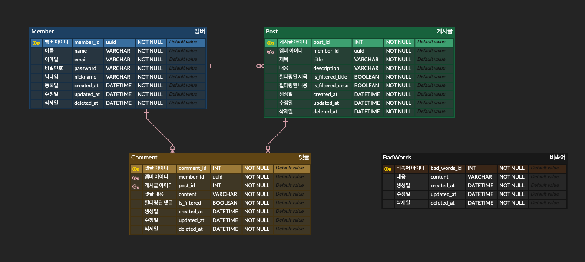

# 1Day-1Project

## BackEnd - 심재두

 

## #프로젝트 소개
- 1D-1Project : 하루에 3~4개의 테이블로 구성하여 사이드 프로젝트를 진행
- 멤버/게시글/댓글/비속어 테이블로 구성되어 있으며, 멤버에 대한 ID값은 uuid값이고 bcrypt 모듈을 만들어 OOP 형식으로 적용
- 하나의 멤버는 여러개의 게시글과 댓글을 작성할 수 있으며, 게시글과 댓글에 관해서 비속어 테이블에 저장되어 있는 단어가 들어갈 때 개발자가 설정한 단어로 필터링이 된다.
- 비속어가 필터링되고, 해당하는 **Post**/**Comment** 테이블에서는 필터링된 단어의 유무를 알 수 있게 Boolean타입으로 true/false처리가 된다.

## Rest API
| Content   | Method   | Path                               |
|-----------|----------|------------------------------------|
| 멤버생성      | `POST`   | /members                           |
| 멤버수정      | `PUT`    | /members/:memberId                 |
| 멤버 비밀번호수정 | `PATCH`  | /members/password/:memberId        |
| 멤버조회      | `GET`    | /members/:memberId                 |
| 멤버 목록조회   | `GET`    | /members                           |
| 멤버삭제      | `DELETE` | /members/:memberId                 |
| 게시글 생성    | `POST`   | /posts                             |
| 게시글 수정    | `PUT`    | /posts/:postId                     |
| 게시글 삭제    | `DELETE` | /posts/:postId                     |
| 게시글 조회    | `GET`    | /posts/:postId                     |
| 게시글 목록조회  | `GET`    | /posts                             |
| 댓글생성      | `POST`   | /posts/:postId/comments            |
| 댓글수정      | `PATCH`  | /posts/:postId/comments/:commentId |
| 댓글삭제      | `DELETE` | /posts/:postId/comments/:commentId |
| 댓글조회      | `GET`    | /posts/:postId/comments/:commentId |
| 댓글 목록조회   | `GET`    | /posts/comments                    |
| 비속어 생성    | `POST`   | /badwords                          |
| 비속어 수정    | `PATCH`  | /badwords/:id                      |
| 비속어 삭제    | `DELETE` | /badwords/:id                      |
| 비속어 조회    | `GET`    | /badwords/:id                      |
| 비속어 목록조회  | `GET`    | /badwords                          |

### 사용기술

- TypeScript
- NestJs
- Prisma
- PostgreSQL
- Docker


### Server Use

```bash
npm run start:dev
```

### Install
```angular2html
npm i | npm install
```

### Docker PostgreServer Port
```angular2html
5432:5432
```